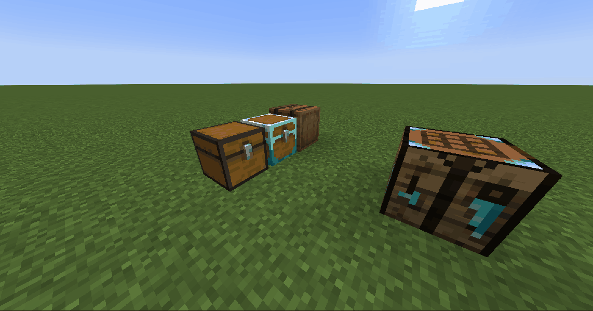
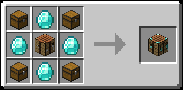

# Proximity Crafting

**Proximity Crafting** is a modular Minecraft mod that adds a custom crafting table which can use ingredients from nearby inventories, so you do not need to manually move everything into your player inventory first.

Current platform status:
- Forge 1.20: reference runtime for this branch
- Fabric 1.20: stable vanilla recipe book target for this branch

## What This Mod Does
- Adds the **Proximity Crafting Table** (3x3 crafting).
- Builds a shared ingredient pool from:
  - nearby containers (chests and compatible inventories),
  - player inventory (configurable).
- Fills crafting recipes directly from that pool.
- Keeps a live ingredient-availability panel for the currently selected recipe.

## Showcase
### Vanilla Recipe Book Integration

## Recipe

## Main Features
- Nearby container scanning with configurable:
  - scan radius,
  - minimum inventory size,
  - block entity blacklist.
- Source priority control (`CONTAINERS_FIRST` or `PLAYER_FIRST`).
- Recipe Book support with nearby-aware source snapshots.
- Shift and scroll recipe loading workflow for faster batch prep.
- Optional persistence for UI toggle states.

## Integrations
### JEI (optional)
- Recipe transfer support to the Proximity Crafting Table.
- Craftable-only flow integrated with the mod source system.
- Nearby-aware recipe fill requests and feedback.

### EMI (optional)
- Recipe transfer support to the Proximity Crafting Table.
- Custom craftable-only toggle flow designed to avoid conflicts with EMI's own craftable sidebar behavior.
- Alt-click and scroll-assisted loading behaviors integrated with Nearby/Proximity sources.

## Mouse Shortcuts
When using Proximity Crafting recipe interactions (including overlay integrations), these shortcuts speed up recipe loading:

- `Alt + Left Click`: loads ingredients for **1 recipe unit** directly into the crafting grid.
- `Shift + Left Click`: loads the **maximum possible amount** (up to configured limits and grid capacity).
- `Mouse Wheel` (incremental load):
  - scroll up increases loaded recipe amount step-by-step,
  - scroll down decreases loaded amount and returns ingredients through the tracked source flow.

## Supported Platforms
- Minecraft `1.20`
- Java `17`
- Forge `46.x`
  - reference runtime
- Fabric `1.20`
  - vanilla recipe book target for this branch

## Optional Dependencies
- JEI
  - relevant to the Forge runtime on this branch
- EMI
  - relevant to the Forge runtime on this branch
- FastSuite
  - Highly recommended for large modpacks.
  - It significantly improves recipe lookup and crafting-related performance, which also helps Proximity Crafting interactions such as incremental scroll loading.

## Configuration
The mod generates TOML config files for both server and client.

### Server config (`proximitycrafting-server.toml`)
All options are under `proximityCrafting`.

Platform note:
- Forge uses the native Forge config path/binding.
- Fabric and NeoForge currently use a lightweight file-backed binding for the same shared config records.

Server options:
- `scanRadius` (default: `6`): scan radius in blocks around the Proximity Crafting Table.
- `minSlotCount` (default: `6`): minimum slot count for an inventory to be considered a valid source.
- `blockEntityBlacklist` (default: furnace, blast_furnace, smoker): block entity IDs excluded from source scanning.
- `maxShiftCraftIterations` (default: `64`): max recipe units loaded into the grid during max-transfer operations (shift-style load).
- `debugLogging` (default: `false`): enables debug logs for scanning and recipe fill flow.

### Client config (`proximitycrafting-client.toml`)
All options are under `proximityCrafting`:
- `autoRefillAfterCraft` (default: `true`): automatically refills the grid after taking the crafted output.
- `includePlayerInventory` (default: `true`): includes player inventory as ingredient source.
- `sourcePriority` (default: `CONTAINERS_FIRST`): extraction order (`CONTAINERS_FIRST` or `PLAYER_FIRST`).
- `rememberToggleStates` (default: `true`): remembers panel/toggle UI states between openings.
- `proximityItemsPanelOpen` (default: `true`): last remembered state of the Ingredients panel.
- `proximityItemsPanelOffsetX` (default: `0`): Ingredients panel horizontal offset.
- `proximityItemsPanelOffsetY` (default: `0`): Ingredients panel vertical offset.

Forge-only remembered overlay options:
- `jeiCraftableOnlyEnabled` (default: `false`): last remembered state of JEI Craftable Only.
- `emiCraftableOnlyEnabled` (default: `false`): last remembered state of EMI Craftable Only.

## License
This project is licensed under **GPL-3.0-only**.
